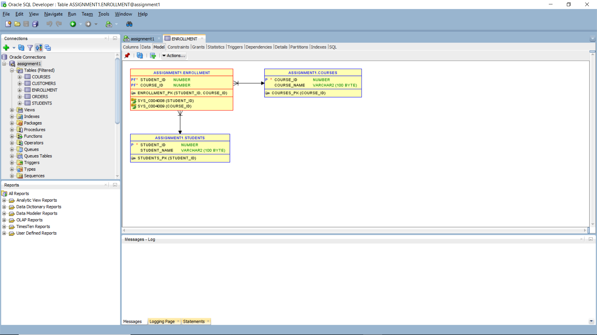
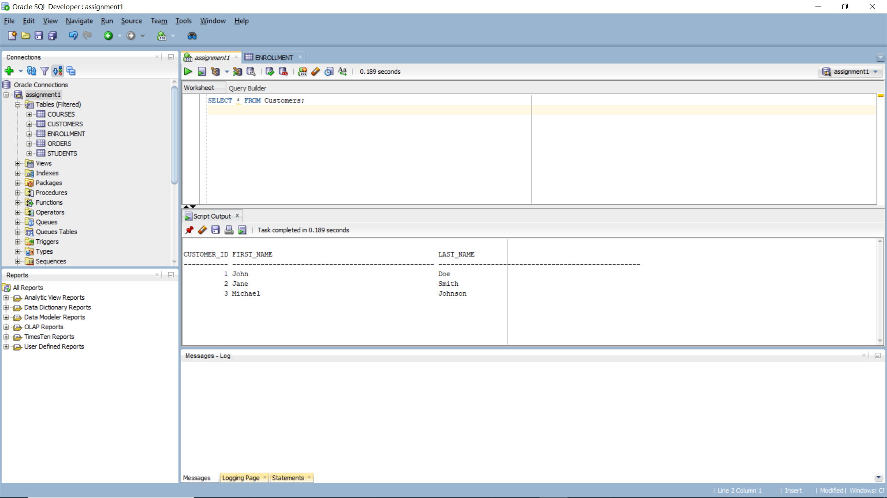
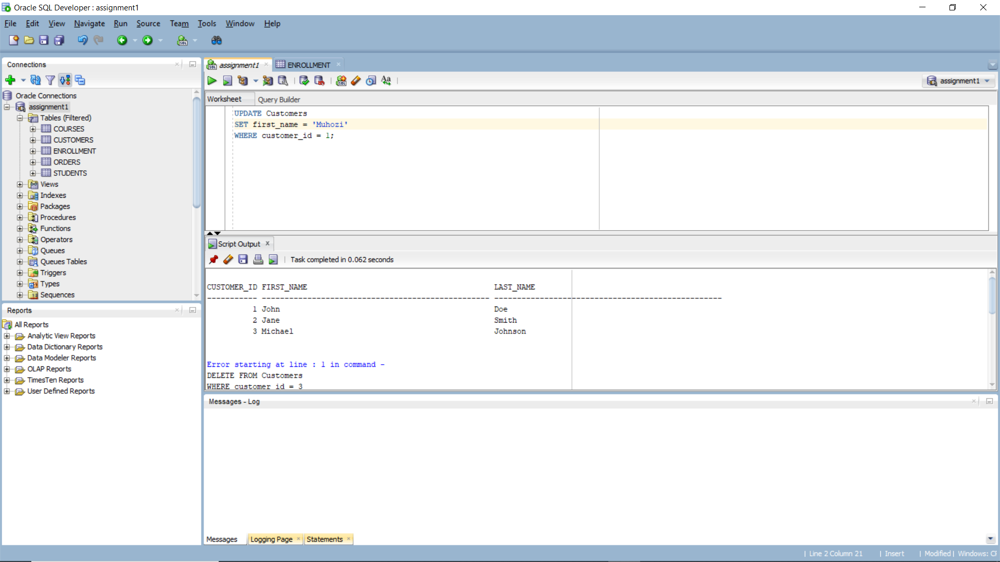
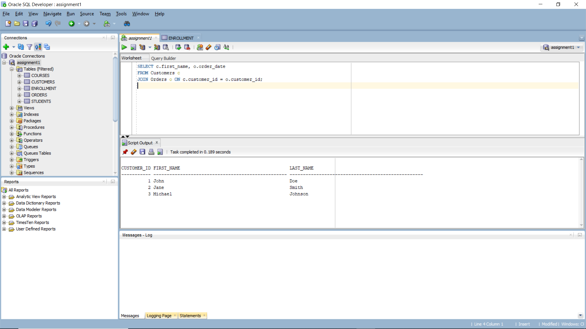
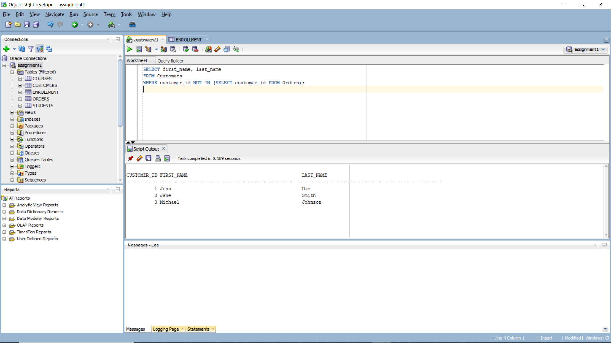

# Oracle SQL Test Scripts

## Problem Statement

This repository contains SQL commands to manage a system for handling customer orders. The system includes tables for `Customers` and `Orders` with relationships between them. This test database allows you to add, modify, and delete customer information and their related orders.

## SQL Commands Executed

- **DDL (Data Definition Language):**
  - Created tables `Customers` and `Orders`.
  - Defined primary and foreign keys.
- **DML (Data Manipulation Language):**
  - Inserted, updated, and deleted records in the tables.
- **Joins and Subqueries:**
  - Performed joins to retrieve customer orders.

## Conceptual Diagram

## Sample SQL Queries

## Results Explanation

first query: This query retrieves all records from the Customers table. The result displays the customer_id, first_name, and last_name of each customer

second query: This command updates the first_name of the customer with customer_id = 1. In this case, the name "John" is changed to "Muhozi"

third query: This query performs an inner join between the Customers and Orders tables. It retrieves the first_name of each customer along with the order_date from the Orders table for customers who have placed an order

fourth query: This query retrieves all customers who have not placed any orders. The subquery selects customer_ids from the Orders table, and the outer query filters out any customers whose customer_id appears in that list

## Transaction Explanation

In SQL, a transaction is a sequence of database operations that are executed as a single unit of work. These transactions can be controlled using commands like COMMIT and ROLLBACK.
